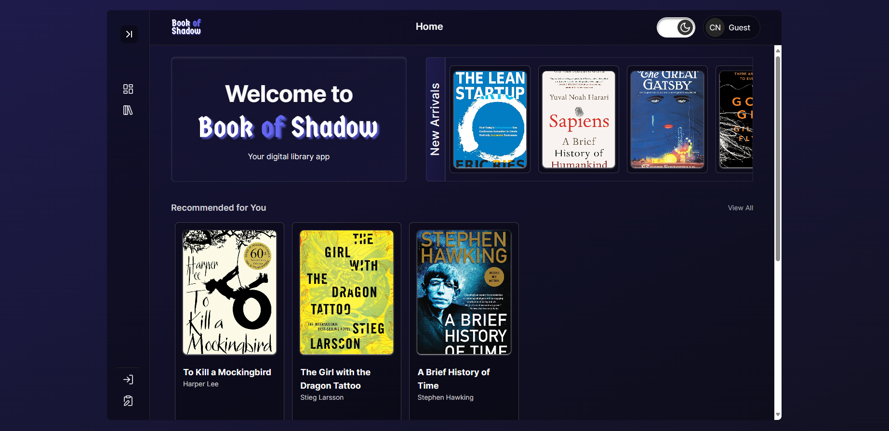

# Book Of Shadow - Library App

Book of shadow is a library app website, you can see all books you want and than can borrow you want to read.

Reference UI/UX by `Kenson_CS Official`

Let see: [_here_](https://book-of-shadow.vercel.app/).

## Features

- Login and register for user
- View all books
- New arrival books
- Recomended for you to read books
- Borrow books you want
- Historry your borrow book
- Edit profile on user or admin
- In admin user can add, edit delete the book
- Admin user can see all borrows book from user, also can edit and delete history borrows books.
- Already theme light and dark mode

## Development

- [React](https://react.dev/)
- [Vite](https://vitejs.dev/)
- [Tailwind CSS](https://tailwindcss.com/)
- [Shadcn/ui](https://ui.shadcn.com/)
- [Zustand](https://zustand-demo.pmnd.rs/)
- [Visual Studio Code](https://code.visualstudio.com/)

## Dependencies

- "axios": "^1.6.1",
- "class-variance-authority": "^0.7.0",
- "clsx": "^2.0.0",
- "date-fns": "^2.30.0",
- "lucide-react": "^0.292.0",
- "react": "^18.2.0",
- "react-day-picker": "^8.9.1",
- "react-dom": "^18.2.0",
- "react-hook-form": "^7.48.2",
- "react-router-dom": "^6.18.0",
- "tailwind-merge": "^2.0.0",
- "tailwindcss-animate": "^1.0.7",
- "zod": "^3.22.4",
- "zustand": "^4.4.6"

## Screenshots

